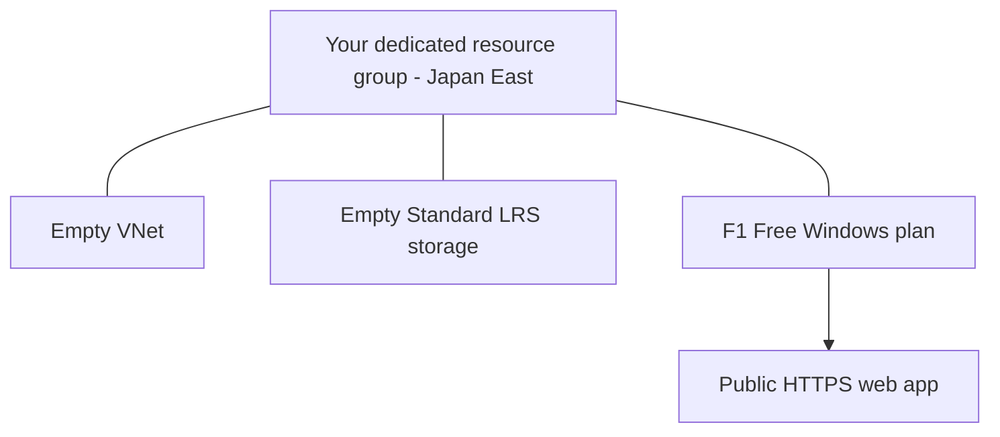

# tf-basics-lab01: your first Terraform on Azure

**For:** first-time Terraform users. **Time:** 2-3 hours after tools and Azure access are ready.

Terraform turns configuration files into Azure resources. In this lab you create a small example, change a tag, delete it, then try reusable modules.

> **Before cloud work:** ask the instructor to confirm Windows **F1 Free quota in Japan East** and permitted Azure policies. The isolated rehearsal stopped on F1 quota 0; a full live deployment is **not yet verified**. See [verification](docs/verification.md). You can still read the code and run mock tests without Azure.

## What you will create

All resources are in **Japan East (`japaneast`)**, inside a **new resource group you create and own**.

| Resource | Why it is here | Cost/scope rule |
| --- | --- | --- |
| Empty virtual network (VNet) | Learn private address ranges | No VM, subnet, peering, gateway, public IP, or paid DDoS plan |
| Empty storage account | Learn resource settings and unique names | `Standard_LRS`; storage usage/operations can cost money |
| Windows App Service web app | See a real HTTPS endpoint | Default Azure welcome page; no custom app code |
| App Service plan | Required host for the web app | **F1 Free only**, never a paid fallback |

The resource group is a prerequisite, not managed by these Terraform examples. **Do not use a production or shared group.**

The three services are deliberately **not integrated**. F1 cannot use VNet integration. The storage account blocks public data access and contains no files. The web app's default HTTPS page is public. This is an IaC lesson, not a production application architecture.

## Follow this route

| Step | Open | You are done when... |
| --- | --- | --- |
| 1 | [Setup](docs/01-setup.md) | Tools work; your subscription, empty group and inputs are checked |
| 2 | [First deployment](docs/02-first-deployment.md) | Four resources exist; HTTPS works; a repeat plan says no changes |
| 3 | [Cleanup, A-D only](docs/04-cleanup.md) | Basic resources are gone; **keep the empty group** |
| 4 | [Copilot and AVM](docs/03-copilot-and-avm.md) | You understand a module and have checked the AVM deployment |
| 5 | [Cleanup, A-E](docs/04-cleanup.md) | AVM resources and the empty group are gone |

Need help? [Tools](docs/tool-setup.md) · [Your inputs](docs/participant-inputs.md) · [Resume an existing lab](docs/resume.md) · [Command meanings](docs/command-reference.md) · [Troubleshooting](docs/troubleshooting.md) · [Official references](docs/references.md).

## Before you start

- An Azure subscription you are allowed to use. Creating a new group requires subscription-level resource-group creation permission; managing the workload needs Contributor on **only your lab group**. Ask an administrator if you do not have these permissions.
- Windows PowerShell 5.1 or PowerShell 7, VS Code, Terraform **1.16.3**, Azure CLI, and Git. Follow [tool setup](docs/tool-setup.md) if anything is missing.
- **Optional:** GitHub/Copilot access for the AI exercise. The supplied module answer works without Copilot.
- Internet access to download signed providers and version-pinned modules.
- Free-plan availability and quota in Japan East. A region being listed is not a capacity reservation. **Stop if F1 is unavailable; do not change to B1 or another paid SKU.**

## Important habits

- Copy **one complete PowerShell block at a time** into the terminal, press Enter, and compare its result with **Expected**. Do not copy headings, output examples, or the opening/closing backticks.
- Copy opening `. {` and closing `}` lines too: they group dependent commands into one PowerShell operation and keep your variables available. A `throw` stops that operation; do not remove error checks or paste the next block after an error.
- Save files before running Terraform. Always check which folder the terminal is in.
- Complete Azure sign-in in the Microsoft account window/browser. Never paste passwords, tokens, storage keys, or client secrets into Terraform or Copilot.
- Do not upload state or saved plans. Even without authored secrets, providers can record sensitive data in state.
- Run only **one deployed example at a time**. The basic and AVM examples have separate state; they are not an in-place migration.
- Storage is not guaranteed free. Keep it empty and complete cleanup during the workshop. A budget alert is a notification, not a hard spending cap.

## What is provided

- [Basic resources](examples/01-basic/main.tf), using the AzureRM provider directly.
- [Equivalent AVM composition](examples/02-avm/main.tf), using four pinned modules and the AzAPI provider.
- [A local network-module answer](solutions/network-module/main.tf) to compare with Copilot's work.
- Mock tests in both examples. They use no Azure credentials and do not prove regional availability, quota, policy acceptance, or a live deployment.

**Finish line:** explain `init`, `plan`, `apply`, `destroy`, state, a provider, and a module in your own words; verify that your lab resources are gone.
